 

### ✦ Hello, I'm Cadden

A student in Singapore building useful tools, playful experiments, and the occasional roast of your Git history.

I'm interested in **software engineering** and **AI/ML**, especially turning **LLMs** into things people can actually use. I like shipping small tools that do one thing properly.

**Currently exploring:** LLM applications, developer tools, and data visualisation.

Open to collaborations, internships, and a good conversation about tech.

 

 

### ✦ Things I've Built

<table align="center">
<tr>
<td rowspan="7" width="260" align="center" valign="middle">

</td>
<th align="left">Project</th>
<th align="left">What it does</th>
</tr>
<tr>
  <td><a href="https://github.com/cadzchua/gitroast"><b>gitroast</b></a></td>
  <td>A CLI that grades your Git habits and roasts your commit history. TypeScript · Node.js</td>
</tr>
<tr>
  <td><a href="https://github.com/cadzchua/code-exp-2026"><b>Auntie's School of Suss</b></a></td>
  <td>A Singlish auntie helps you spot misinformation and check suspicious messages. Built for Code-Exp 2026. React · TypeScript · Spring Boot</td>
</tr>
<tr>
  <td><a href="https://github.com/cadzchua/LocateTheShip"><b>LocateTheShip</b></a></td>
  <td>Maps vessel locations and identities using an open API. Python · REST</td>
</tr>
<tr>
  <td><a href="https://github.com/cadzchua/CommViz"><b>CommViz</b></a></td>
  <td>Turns call logs, emails, and messages into interactive contact networks. Python · Streamlit</td>
</tr>
<tr>
  <td><a href="https://github.com/cadzchua/SC2002_Group_Assignment_25S1"><b>Internship Placement System</b></a></td>
  <td>Manages internship applications for students, companies, and career centre staff. SC2002 team project. Java</td>
</tr>
<tr>
  <td><a href="https://github.com/cadzchua/portfolio"><b>portfolio</b></a></td>
  <td>A home for my projects, experience, and experiments. TypeScript · Next.js</td>
</tr>
</table>

<a href="https://github.com/cadzchua?tab=repositories">Explore all repositories →</a>

 

### ✦ Profile & Activity

  
  

Updated daily · Contributions cover the past 12 months · Languages measured by code size

  

### 🐍 Watch the snake eat my contributions

<picture>
  <source media="(prefers-color-scheme: dark)" srcset="https://raw.githubusercontent.com/cadzchua/cadzchua/output/github-snake-dark.svg"/>
  <source media="(prefers-color-scheme: light)" srcset="https://raw.githubusercontent.com/cadzchua/cadzchua/output/github-snake.svg"/>
  
</picture>

